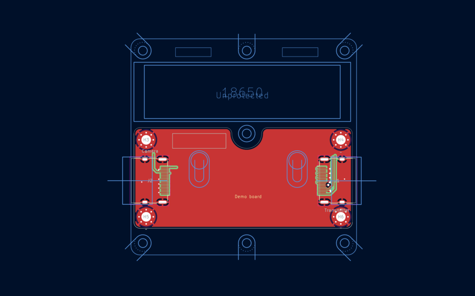
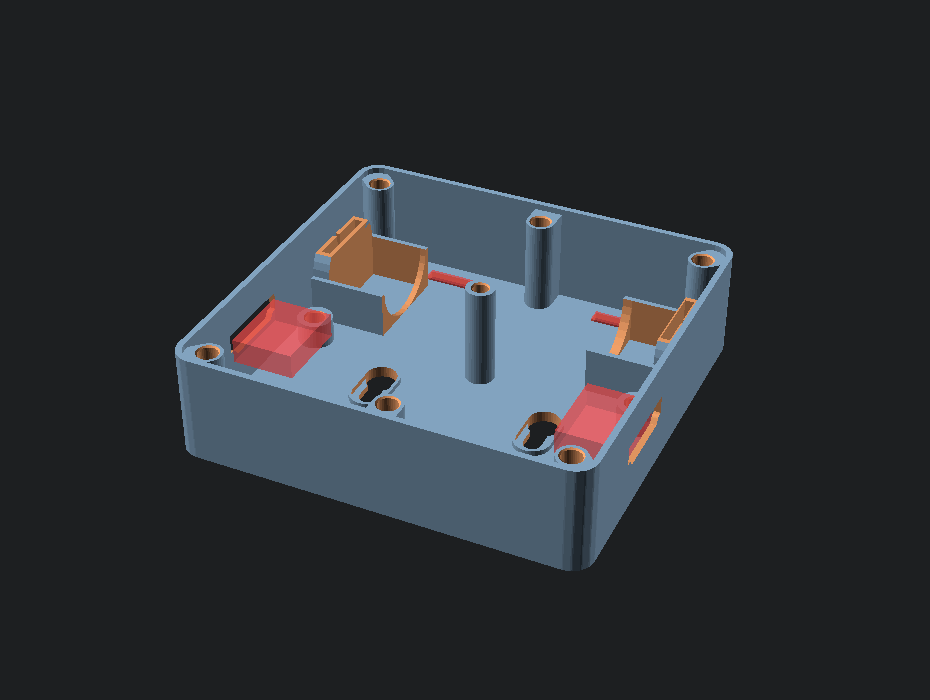

# Turbocase

Making a nice case for a PCB project is not terribly hard, but it is annoyingly time consuming if you just want a
simple functional case. This most of the time for a case design for me is spend on figuring out how to align the
mounting holes in the PCB with the 3D print and ensure the cutouts for the connectors are correct.

This project provides a ~~hacky~~ neat way to generate an OpenSCAD project based on the data in a KiCAD PCB file.

To define the shape of the case create a drawing of inside edge of the case on one of the user layers. This follows
the same semantics as the PCB fabrication outline on the Edge.Cuts layer. By default turbocase reads the outline from
the User.6 layer.

Turbocase will automatically extract information about MountingHole footprints and place plastic posts underneath the
PCB to fit threaded metal inserts after 3D printing. It currently is hardcoded to the bag of M3 inserts I have.

For connectors KiCAD needs to learn about the third dimension. For this purpose I have added a "Height" property to
the connects I want to be processed by turbocase that defines the height from the top of the PCB to the top of the
connector so an appropiate cutout can be made in the case. The rest of the shape of the connector is defined by the
bounding box of the F.Fab layer of the connector.

An example of a KiCAD PCB with a case outline on `User.6`:


The generated case from this file:


## Installation

```shell-session
$ pip install turbocase
```

## Usage

1. Create a case outline in the `User.6` layer using the line drawing tools.
2. Add the `Height` property to the connector footprints that need to be in the case export
3. Ensure the screw holes for the PCB are MountingHole footprints
4. Run the turbocase tool to make an OpenSCAD file:

```shell-session
$ turbocase project/project.kicad_pcb case.scad
```

## Footprints

TurboCase can automatically add prefab structures to the generated case by using the included KiCad library.
The TurboCase.pretty folder in this repository is the footprint library that defines custom objects to add to the
design of your case. The tool will detect any footprints that start with `TurboCase:` and append the correct module
from `parts.py` into the final OpenSCAD file.

## Command line options

```
usage: turbocase [-h] [--layer LAYER] [--bottom BOTTOM] [--wall WALL] pcb output

positional arguments:
  pcb              Input kicad PCB file
  output           Generated openSCAD case template

options:
  -h, --help       show this help message and exit
  --layer LAYER    Layer with the case inner-outline [defaults to User.6]
  --bottom BOTTOM  Bottom thickness in mm [default 1.2]
  --wall WALL      Wall thickness in mm [default 1.2]
```